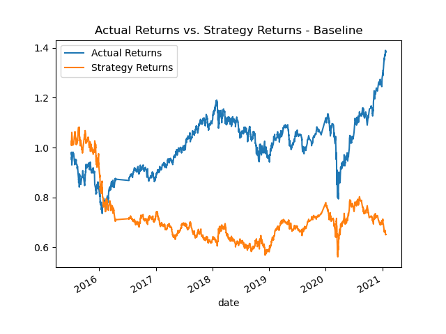
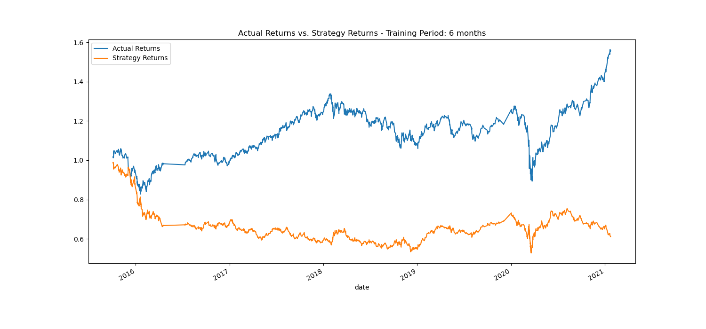
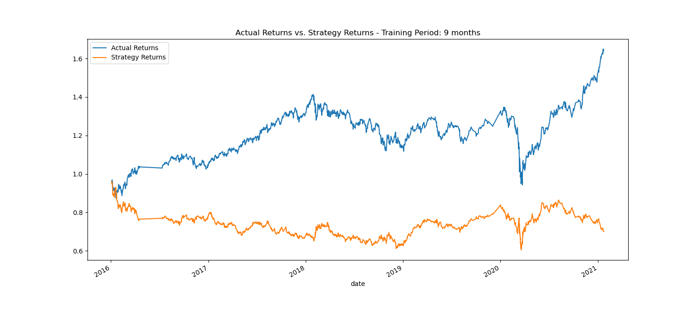
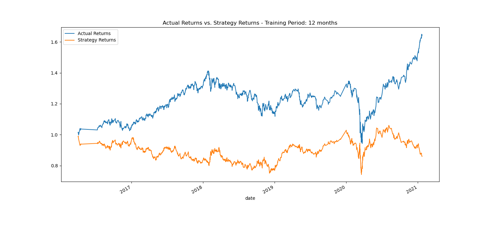
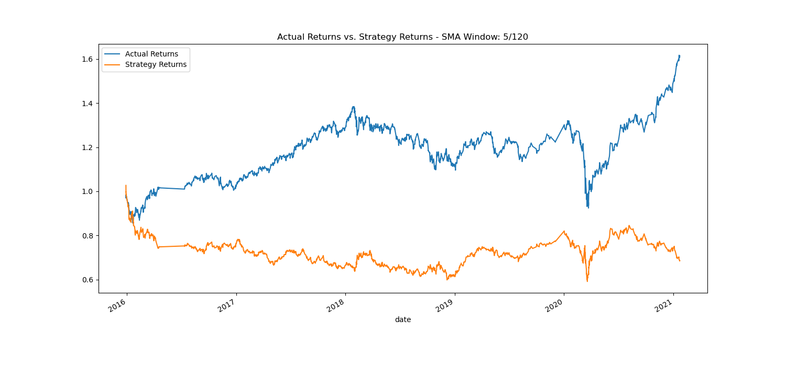
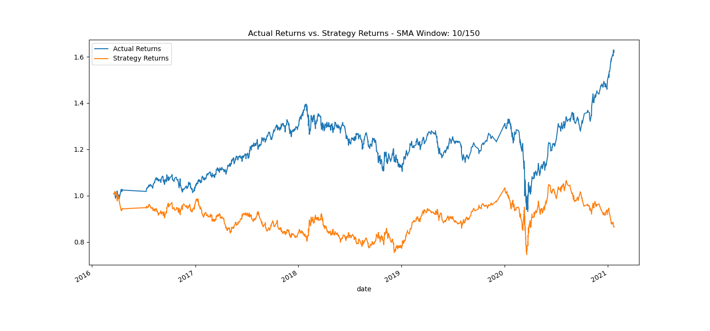
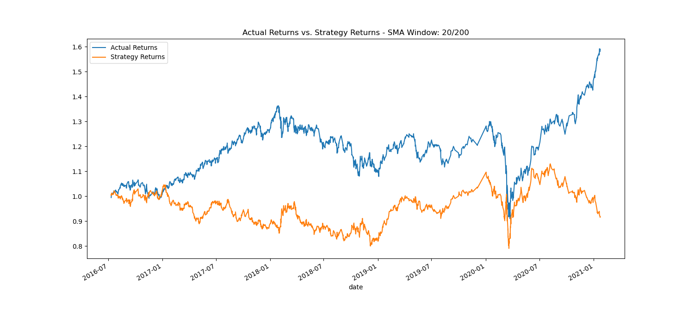

# Algorithmic_Trading_bot
Algorithmic trading, python programming and machine learning application

## Establish a Baseline Performance
The SVC model, providing our baseline performance, results in the following metrics:

|            | Accuracy | Long precision | Long recall | Short precision | Short recall |
|:---------- |:--------:|:--------------:|:-----------:|:---------------:|:------------:|
| **Result** | 0.55     |   1.0          |    0.56     |       -1.0      |    0.46      |

## Tune the Baseline Trading Algorithm

*In this section, you’ll tune, or adjust, the model’s input features to find the parameters that result in the best trading outcomes. (You’ll choose the best by comparing the cumulative products of the strategy returns.) To do so, complete the following steps:

# Tune the training algorithm by adjusting the size of the training dataset. To do so, slice your data into different periods. Rerun the notebook with the updated parameters, and record the results in your README.md file. Answer the following question: What impact resulted from increasing or decreasing the training window?

* Training Period: 6 months

|            | Accuracy | Long precision | Long recall | Short precision | Short recall |
|:---------- |:--------:|:--------------:|:-----------:|:---------------:|:------------:|
| **Result** |  0.56   |    0.56          | 0.98       |    0.44         |    0.02     |

* Training Period: 9 months

|            | Accuracy | Long precision | Long recall | Short precision | Short recall |
|:---------- |:--------:|:--------------:|:-----------:|:---------------:|:------------:|
| **Result** |  0.53   |    0.57          | 0.70       |    0.45        |    0.31    |

* Training Period: 12 months

|            | Accuracy | Long precision | Long recall | Short precision | Short recall |
|:---------- |:--------:|:--------------:|:-----------:|:---------------:|:------------:|
| **Result** |  0.56   |    0.56          | 1.00        |    0.72        | 0.00        |

* Training Period: 15 months

|            | Accuracy | Long precision | Long recall | Short precision | Short recall |
|:---------- |:--------:|:--------------:|:-----------:|:---------------:|:------------:|
| **Result** |  0.56   |    0.56          | 1.00        |    1.00        | 0.00        |

## Tune the trading algorithm by adjusting the SMA input features. Adjust one or both of the windows for the algorithm. Rerun the notebook with the updated parameters, and record the results in your README.md file. Answer the following question: What impact resulted from increasing or decreasing either or both of the SMA windows?

SMA Window: 5/120

|            | Accuracy | Long precision | Long recall | Short precision | Short recall |
|:---------- |:--------:|:--------------:|:-----------:|:---------------:|:------------:|
| **Result** |  0.52    | 0.57          | 0.64         |    0.45          | 0.38         |

*SMA Window: 10/150

|            | Accuracy | Long precision | Long recall | Short precision | Short recall |
|:---------- |:--------:|:--------------:|:-----------:|:---------------:|:------------:|
| **Result** | 0.56     | 0.56           | 1.00        | 1.00           | 0.00        |

*SMA Window: 20/200

|            | Accuracy | Long precision | Long recall | Short precision | Short recall |
|:---------- |:--------:|:--------------:|:-----------:|:---------------:|:------------:|
| **Result** | 0.44     | 1.00           | 0.00       | 0.44            | 1.00        |

       

|            | Accuracy | Long precision | Long recall | Short precision | Short recall |
|:---------- |:--------:|:--------------:|:-----------:|:---------------:|:------------:|
| **Result** | 0.44     | 0.48           | 0.01       | 0.43            | 0.98         |

          
